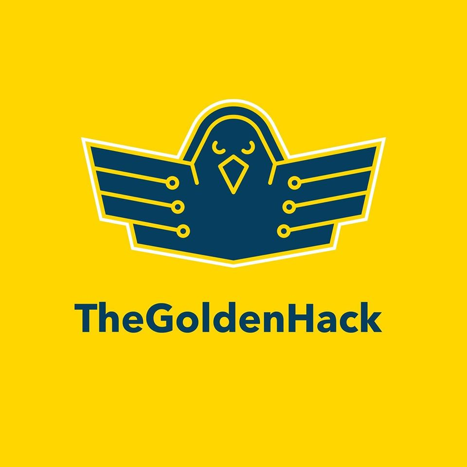
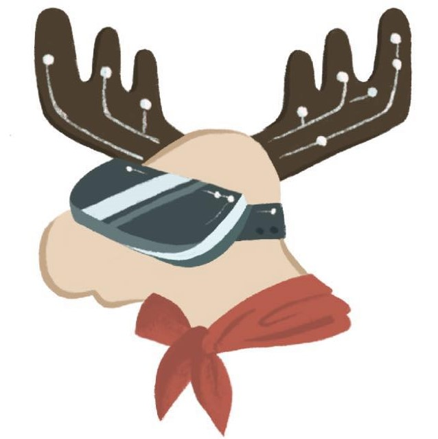

# Hackathon-Sustainability-Standard
## Global hackathon industry sustainability standard document.

## Participating Hackathons

| Hack The Valley | Delta Hacks | Hackville | The Goldenhack | TOHacks | UW EnergyHacks |
| :-------------: | :------------: | :------------: | :-------------: | :------------: | :------------: |
|   |  |  |  |  |  |
| **Make UofT** | **EduHacks** | **Hack the Hammer** | **Hack to TRU** | **StarterHacks** | **Electric City Hacks** |
|   |  |  |  |  |  |
| **RU Hacks** | **ConUHacks** | **SheHacks** | **HackED** | **QHacks** | **UofT Hacks** |
|   |  |  |  |  |   |
| **cmd-f** | **nwHacks** | **UBC Local Hack Day** | **Hack the Globe** | **uOttaHack3** | |
|  |  |  |  |  | |
### Sponsor Swag Waste Reduction
**Objective #1:**

Reduce the amount of extra swag. 

**Key results:**

Have a maximum of 2% sponsor swag leftovers by the end of the hackathon.

**Action Items:**

Swag leftovers can be distributed to hackers at the end of the closing ceremony.

 

**Objective #2:**

Provide hackers more reusable items. 

**Key Results:**

Make the swag bag at least 80% eco-friendly.

**Action Items:**

Ask sponsors for items like reusable plastic water bottles, reusable coffee cups, mugs, stainless steel straw.

For prizes, using reusable bags not gifts bags and limit/eradicate excessive tissue paper.

## Food Waste Reduction
**Objective #1:**

Reduce the amount of food and packages waste. 

**Key results:**

Have a maximum of 3% food and package waste after every meal.

**Action Items:**

Donate food leftovers to residence centers or communal student spaces within one hour after breakfast/lunch/dinner time to maintain the freshness of food.

Ensure compost bins are available and visible for food waste.

Provide maps of venue highlighting where the recycling/compost/garbage bins and water fountains are located. Because the location of the bins can change, we can keep an updated map in slack.

Offer paper food takeaway containers when giving out food to avoid food waste, this will help reduce people throw food in the trash, by giving hackers the option to store and eat food at their own convenience. 

Microwaves should be all around campus to help them reheat the food.

Get condiments in bulk rather than in small packaging.

Encourage and remind hackers to bring reusable water bottles

Get at least 95% of hackers confirmed at least one week prior to finalize numbers with the Catering companies, including special requests due to dietary restrictions and food allergies. 

Add double of the vegan, halal and gluten-free alternatives requested for last-minute hackers.

Explain in opening ceremonies and registration package how and where to compost/recycle the materials that the hackathon is using

 

**Objective #2:**

Increase the use of reusable utensils. 

**Key Result:**

Have 95% use of reusable utensils. 

**Action Items:**

Avoid use of straws, stir sticks, non-reusable containers, plastic packaging, etc.

Notify the catering companies about our food waste reduction plan to encourage them to use reusable or biodegradable utensils and containers.

## Supplies Reduction
**Objective #1:**

Purchase reusable and eco-labeled products that can be used for future events.

**Key results:**

Keep 70% of the supplies for next year, instead of throwing them away and buy new  ones in the future. 

**Action Items:**

Borrow as many (office) supplies as possible.

Provide reusable lanyards and ask hackers to return them for future events.

 

**Objective #2:**

Purchase sustainably produced apparel.

**Key Results:**

100% sustainably produced apparel.

**Action Items:**

Purchase durable clothing

Purchase clothes made from recycled materials

Attempt to avoid polyester 

 

**Objective #3:**

Reduce waste of apparel from over ordering. 

**Key Results:**

Have a maximum of 2% of apparel left over at the end of event. 

**Action Items:**

Accurate count of the different sizes of apparel so there won’t be leftovers.

Distribute leftover apparel to hackers. 

## Transportation
**Objective:**

Reduce environmental footprint by cutting down carbon emissions. 

**Key results:**

Have 80% of attendees report as carpooling or commuting.

**Action Items:**

Use Facebook group and/or Slack channel to mention that there will be limited parking and maybe provide parking discount if carpooling with 3 or more hackers.

Provide shuttle buses from centric places.

Provide schedules of public transportation around campus, share links and common routes from campus.

Put out post event surveys to collect information on how hackers commuted to the event. 

## Go paperless!
**Objective:** 

Only use digital communication.

**Key results:**

Reduce printed handouts and documents by 100%.

**Action Items:**

Keep promotional materials digital, including the agenda and information documents.

Provide clear digital maps of the campus to hackers and sponsors.
